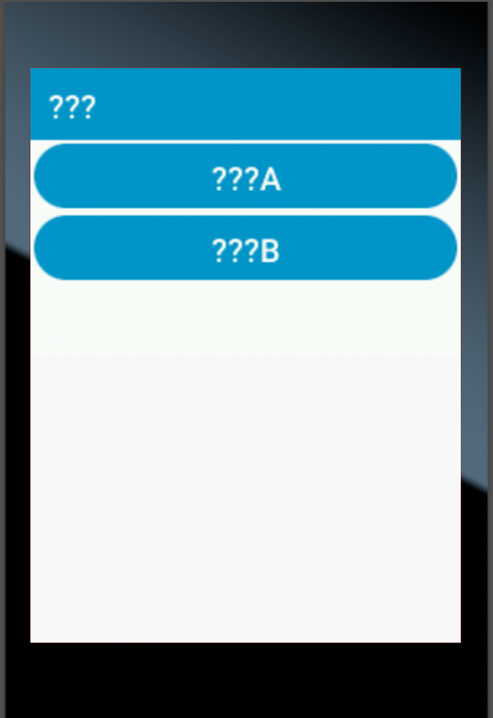
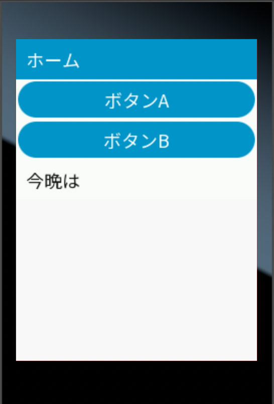

# node-red-mcu-dashboard-japanese

Node-RED MCU Editionで使用するnode-red-dashboardを日本語化する。

Noto Sans JapaneseフォントのNotoSansJP-Regular.ttfをベースに、fontbmツールを使用してShift JISに含まれる文字をBMFont(BitMap Font)ファイルに変換しました。

https://fonts.google.com/noto/specimen/Noto+Sans+JP

https://github.com/vladimirgamalyan/fontbm?tab=readme-ov-file

https://raw.github.com/nakamura001/JIS_CharacterSet/master/SHIFTJIS_custom/SHIFTJIS_custom_win_bom_utf8.txt

# 手順

node-red-mcuのdashboardノードのmanifest.jsonとui_templates.jsを置き換えます。
assetsフォルダにNoto-Regular.fntとNoto-Regular.pngファイルを置きます。

node-red-mcu/nodes/dashboard
├── ScrollerBehaviors.js
├── assets
│   ├── Noto-Regular.fnt        (←追加)
│   ├── Noto-Regular.png        (←追加)
│   ├── Roboto-Medium-12.fnt
│   ├── Roboto-Medium-12.png
│   ├── Roboto-Medium-18.fnt
│   ├── Roboto-Medium-18.png
│   ├── Roboto-Regular-18.fnt
│   ├── Roboto-Regular-18.png
│   ├── button.png
│   ├── glyphs.png
│   ├── popup.png
│   ├── slider.png
│   ├── switch.png
│   ├── ui_colour_picker.png
│   └── ui_colour_picker_mask.png
├── manifest.json              (←変更)
├── ui_chart.js
├── ui_colour_picker.js
├── ui_gauge.js
├── ui_nodes.js
├── ui_templates.js            (←変更)
└── ui_text_input.js

(変更前)

(変更後)

